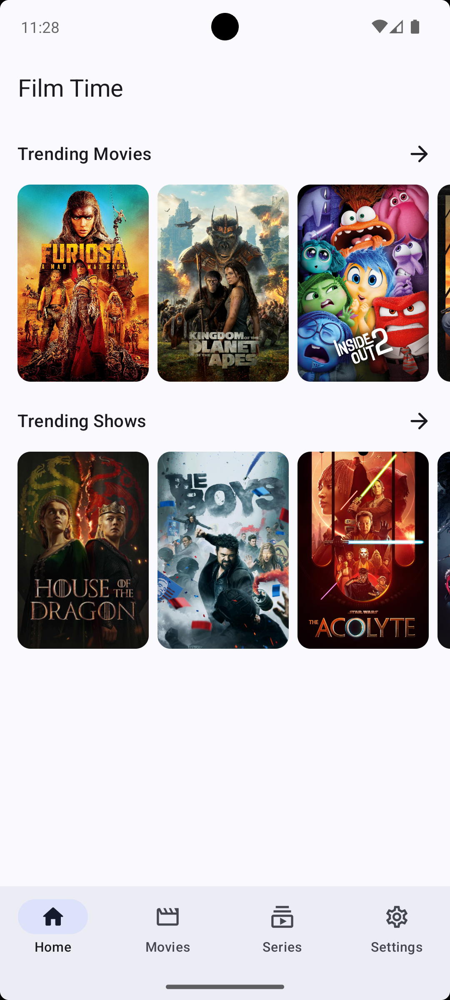
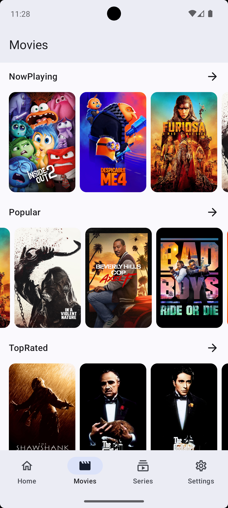

# Film Time  📺🎬

A modern, feature-rich Movie & TV Show tracking application showcasing Android development best practices using Jetpack Compose and Kotlin.

| Home                             | Movies                             | Detail                             | Trakt                             |
|----------------------------------|------------------------------------|------------------------------------|-----------------------------------|
|  |  |  |  |


## Features 🌟
- **Browse** popular, top-rated, and upcoming movies & TV shows.
- **Search** for your favorite movies & shows.
- **Track** movies & TV shows you've watched or want to watch.
- **User Profiles** to manage watchlists and favorites.
- **Dark Mode** for night time browsing.
- ... and much more!

## Tech Stack 🛠
- **Kotlin** - First class and official programming language for Android development.
- **Jetpack Compose** - Android’s modern toolkit for building native UI.
- **Coroutines** - For asynchronous and more..
- **Hilt** - For dependency injection.
- **Retrofit** - A type-safe HTTP client for Android and Java.
- **Room** - For caching most used data

_And more!_

## Architecture 🏛

This app follows the MVVM architectural pattern.

## Getting Started 🚀

1. **Clone** the repository:
```shell
   git clone https://github.com/moallemi/Film-Time.git
   ```
2. Open the project in **Android Studio**.
3. Sync the Gradle files and run the app!

## Development setup

First off, you require the latest [Android Studio Flamingo](https://developer.android.com/studio/preview) (or newer) to be able to build the app.

### Code style

This project uses [ktlint](https://github.com/pinterest/ktlint), provided via
the [spotless](https://github.com/diffplug/spotless) gradle plugin, and the bundled project IntelliJ codestyle.

If you find that one of your pull reviews does not pass the CI server check due to a code style conflict, you can
easily fix it by running: `./gradlew spotlessApply`.

### API keys

You need to supply API / client keys for the various services the
app uses:

- [TMDb](https://developers.themoviedb.org)
- [Trakt](https://trakt.tv/oauth/applications)

You can find information about how to gain access [here](docs/API-Keys.md).

Add this to your `~/.gradle/gradle.properties` file:

```shell
# Get this from TMDb
FILM_TIME_TMDB_API_KEY=<insert>
# Get these from Trakt
FILM_TIME_TRAKT_CLIENT_ID=<insert>
FILM_TIME_TRAKT_CLIENT_SECRET=<insert>
```

Do not forget to restart Android Studio to apply changes to your environment.

## Contributions 🙌

Please read [CONTRIBUTING.md](CONTRIBUTING.md) for details on our code of conduct, and the process for submitting pull requests to us.

## License 📝

This project is licensed under the MIT License - see the [LICENSE.md](LICENSE) file for details.
